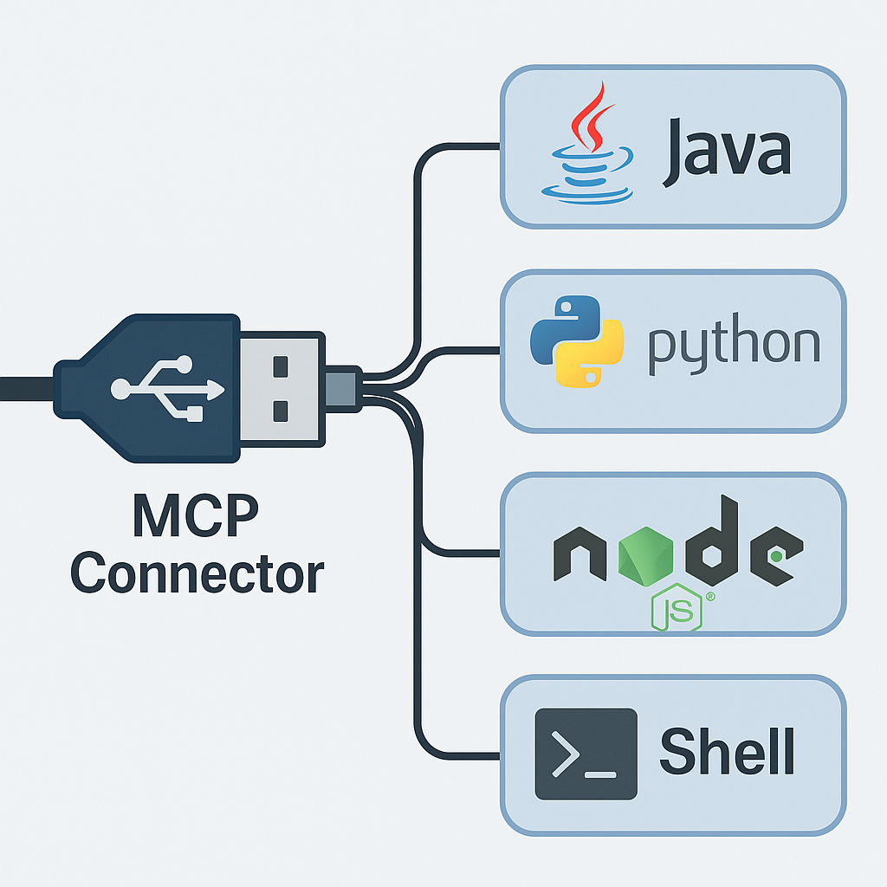

# Java MCP Connector  

This is a **pure Java** implementation of a connector for the MCP (Model Context Protocol. It acts as a bridge between any MCP-compatible client (like Claude or OpenAI tools) and a standard HTTP backend (like a Spring Boot or Node.js server).
You can use with [a2ajava](https://github.com/vishalmysore/a2ajava) which is pure java implementation of A2A protocol and works with MCP protocol as well .
 
---

<p align="center">
  
</p>

## 🔧 How It Works

The connector acts as a **Passthrough Server**. It reads JSON-RPC 2.0 messages from `stdin`, forwards them as HTTP POSTs to a specified backend URL, and returns the HTTP response as the output to `stdout`.

### 🔁 Flow

1. MCP Tool sends a JSON-RPC message to the connector (via `stdin`).
2. Connector receives and parses the input.
3. It sends the message as an HTTP POST to your backend (e.g., `http://localhost:8080`).
4. The backend returns a JSON-RPC-compliant response.
5. Connector prints the response to `stdout` for the AI tool to consume.

This allows **any language backend** (Spring, Flask, Express, etc.) to seamlessly speak MCP.

---

## 🧪 Example Claude Tool Configuration

Update your Claude Desktop tool configuration to use this Java connector:

```json
"routeplanningagent": {
  "command": "java",
  "args": [
    "-jar",
    "/work/a2a-mcp-bridge/target/mcp-connector-full.jar",
    "http://localhost:8080"
  ],
  "timeout": 30000
}
```
For other types of connectors in python, shell , nodejs please read the [guide](article.MD) 

### 🚀 Why Use a Java Connector?
- ✅ Language Independence
You don’t need to implement MCP in your backend; just handle HTTP POSTs.  
- ✅ Better Portability
Can be bundled into a single JAR with all dependencies. Run it on any system with Java.

- ✅ Production Ready
Java is battle-tested for high performance and robust networking.

- ✅ No NodeJS or Python Needed
Ideal for environments with strict runtime policies (e.g., enterprise setups).

- ✅ Custom Logic Support
Easily add authentication, logging, metrics, or normalization of payloads.

🏗️ Build Instructions
Build the connector with Maven:

```
mvn clean package
```
This generates a fat JAR:

💡 Advanced Features
Normalizer Support: (Optional) You can add a RequestNormalizer class to rewrite or preprocess requests before they reach the backend.

Debug Logging: All input/output is logged to stderr for easy debugging.

